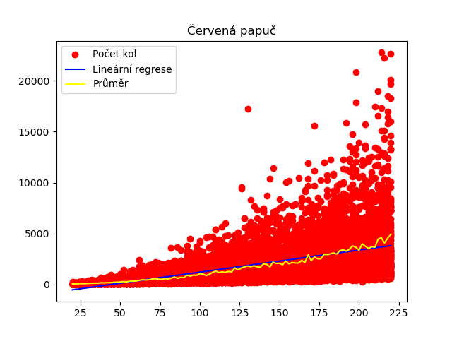

# Červená papuč

Jednoduchá simulace karetní hry červená papuča.

## `cervena_papuca.go`

Obsahuje samotnou simulaci karetni hry. Lze ji volat:

1. Bez argumentů, pak se bere náhodně promáchaný balíček s daným počtem karet.
	- `go run cervena_papuca.go`
2. S jedním argumentem, který představuje počet karet, jinak stejný, jak v předchozím kole.
	- `go run cervena_papuca.go 120`
2. S dvěmi parametry představující konkrétní posloupnsti balíčků.
	- `go run cervena_papuca.go 1100101 1010011`
	- `1` je červená karta a `0` černá

## `test.pl`

