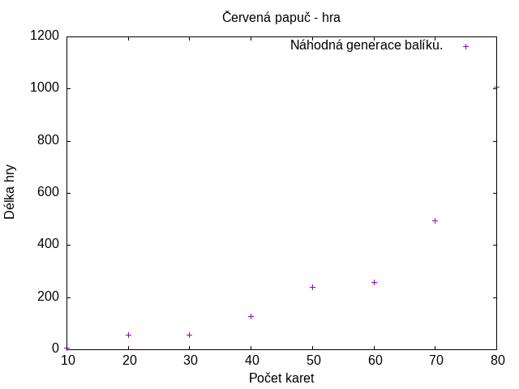

# Červená papuč

Jednoduchá simulace karetní hry červená papuča.

## `cervena_papuca.go`

Obsahuje samotnou simulaci karetni hry. Lze ji volat:

1. Bez argumentů, pak se bere náhodně promáchaný balíček s daným počtem karet.
	- `go run cervena_papuca.go`
2. S jedním argumentem, který představuje počet karet, jinak stejný, jak v předchozím kole.
	- `go run cervena_papuca.go 120`
2. S dvěmi parametry představující konkrétní posloupnsti balíčků.
	- `go run cervena_papuca.go 1100101 1010011`
	- `1` je červená karta a `0` černá

## `run_tests.sh`

Skript na spuštění několika náhodných balíčků. Bere tři argumenty:

1. Počet testů na jednu velikost balíčku.
2. Spodní hranici počtu karet.
3. Horní hranici počtu karet.

Vygeneruje se soubor `RESULTS`.

## `plot.py`

S výsledného souboru `RESULUTS` provede znázornění do obrázku:

A taky standardního balíčku s `32` kartami, z nichž `8` je červených.

